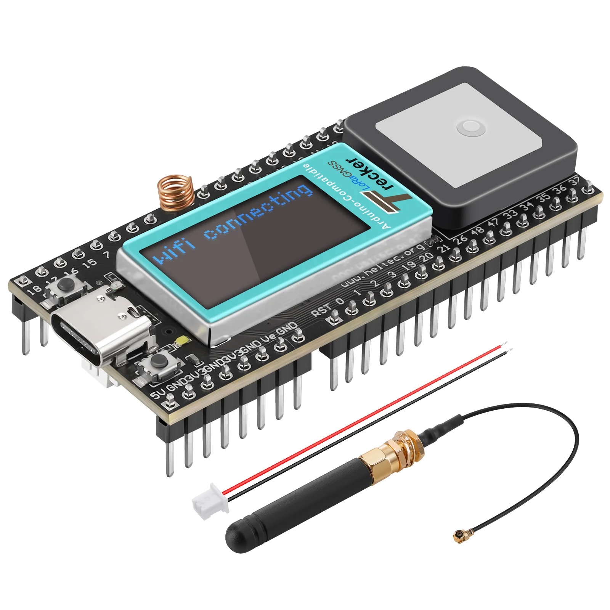
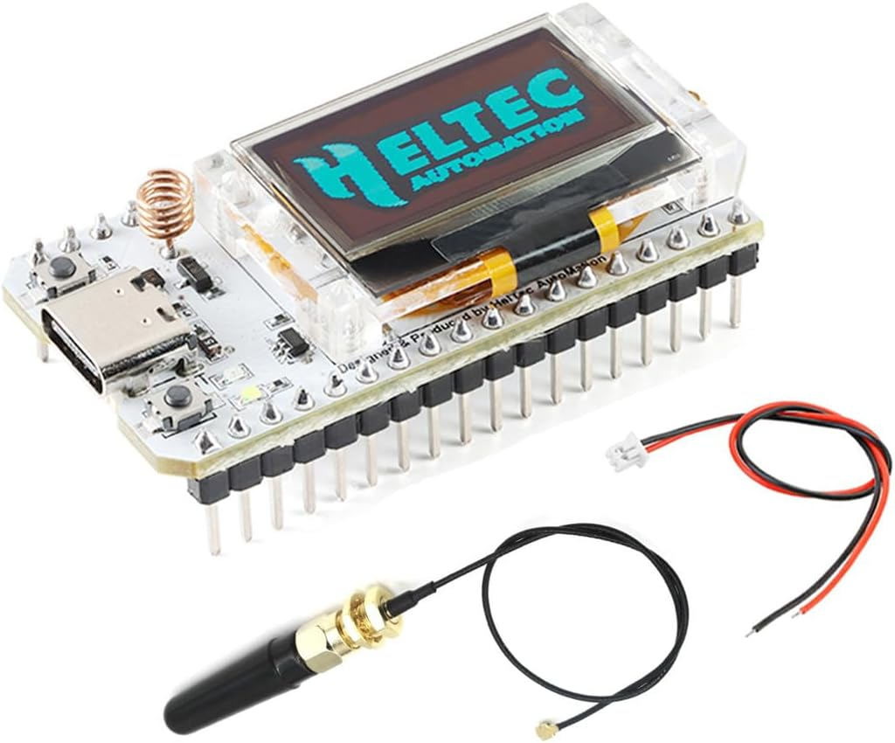

# Introduction

This repository contains MicroPython and Arduino based applications for ESP32 based boards from Heltec Automation. 
Specifically, we have evaluated these applications on following two boards:

## (1) [Heltec Automation Wireless Tracker v1.1](https://resource.heltec.cn/download/Wireless_Tracker/Wireless_Tracker%20_1.1.pdf)



This board contains following components:

- CPU - ESP32-S3FN8 ([datasheet](https://www.espressif.com/sites/default/files/documentation/esp32-s3_datasheet_en.pdf)). ESP32-S3 is a low-power MCU-based system on a chip (SoC) with integrated 2.4 GHz Wi-Fi and Bluetooth® Low Energy (Bluetooth LE). It consists of a high-performance dual-core microprocessor (Xtensa® 32-bit LX7), a ULP coprocessor, a Wi-Fi baseband, a Bluetooth LE baseband, RF module, and numerous peripherals.
- LCD Display: Onboard 0.96-inch 160*80 dot matrix TFT LCD display, based on [ST7735](https://www.displayfuture.com/Display/datasheet/controller/ST7735.pdf)
- [UC6580](https://en.unicore.com/products/dual-band-gps-chip-uc6580/) (GPS SoC): via GNSS (also other satellite systems - QZSS, GLONASS, NAVIC, Galileo)
- [SX1262](https://www.semtech.com/products/wireless-rf/lora-connect/sx1262) (LoRa transceiver) - 868MHz frequency, about -139dBm high sensitivity, +20 dBm power output, high reliability, transmission distance (measured open area communication distance 3.6Km).

Additional Details:

- [Official development doc from Heltec](https://resource.heltec.cn/download/Wireless_Tracker/Wireless_Tracker%20_1.1.pdf)
- [Pin diagram](https://cdn.shopify.com/s/files/1/0084/7465/6845/files/diagram.png?v=1694250615)
- [MicroPython firmware for ESP32](https://micropython.org/download/ESP32_GENERIC_S3/)
- [Arduino library from Heltec](https://github.com/HelTecAutomation/Heltec_ESP32)

## (2) [Heltec Automation Wifi LoRa V3](https://heltec.org/project/wifi-lora-32-v3/)



This board contains following components:

- CPU - ESP32-S3FN8 ([datasheet](https://www.espressif.com/sites/default/files/documentation/esp32-s3_datasheet_en.pdf)). ESP32-S3 is a low-power MCU-based system on a chip (SoC) with integrated 2.4 GHz Wi-Fi and Bluetooth® Low Energy (Bluetooth LE). It consists of a high-performance dual-core microprocessor (Xtensa® 32-bit LX7), a ULP coprocessor, a Wi-Fi baseband, a Bluetooth LE baseband.
- OLED Display: Onboard 0.96-inch 128*64 dot matrix OLED display, based on [SSD1306](https://www.digikey.com/htmldatasheets/production/2047793/0/0/1/ssd1306.html)
- [SX1262](https://www.semtech.com/products/wireless-rf/lora-connect/sx1262) (LoRa transceiver) - 868MHz frequency, about -139dBm high sensitivity, +20 dBm power output, high reliability, transmission distance (measured open area communication distance 3.6Km).
- Integrated [CP2102](https://www.silabs.com/interface/usb-bridges/classic/device.cp2102?tab=specs) USB to serial port chip,
- Onboard 32MByte Flash

Additional Details:

- [Official development doc from Heltec](https://resource.heltec.cn/download/WiFi_LoRa_32_V3/HTIT-WB32LA_V3(Rev1.1).pdf)
- [Official webpage from Heltec](https://heltec.org/project/wifi-lora-32-v3/)
- [Pin diagram](https://heltec.org/wp-content/uploads/2023/09/wifi-lora-32-pin_map.png)
- [MicroPython firmware for ESP32](https://micropython.org/download/ESP32_GENERIC_S3/)
- [CircuitPython firmware for the board](https://circuitpython.org/board/heltec_esp32s3_wifi_lora_v3/)
- [Arduino library from Heltec](https://github.com/HelTecAutomation/Heltec_ESP32)

# Software and Applications

Below we list the applications, their language, and necessary library dependencies to get them working.

## Base Python software

- Heltec Wireless Tracker supports MicroPython only. Its firmware can be found [here](https://micropython.org/download/ESP32_GENERIC_S3/).
- Heltec Wifi LoRa V3 board supports both MicroPython (shared above) and CircuitPython that can be found [here](https://circuitpython.org/board/heltec_esp32s3_wifi_lora_v3/).

Firmware can be flashed on the board using `esptool.py` as:

```
pip install esptool.py
```

```
# Find the port under /dev
esptool.py --chip esp32s3 --port <port> write_flash -z 0 <downloaded_file>
```

## Base Arduino software

- For Heltec Wireless Tracker, select `Heltec Wireless Tracker` in Boards.
- For Heltec Wifi LoRa V3, select `Heltec WiFi LoRa 32 (v3)` in Boards.

## Applications

| Component  | File  |  Board | Language | Necessary software |
| :---- | :---- | :---  | :---- | :--- |
|  Display | [hello_world_micropy](examples/heltec-wireless-tracker-v1.1/python/display_hello_world_micropy.py)  | Heltec Wireless Tracker    |    MicroPython      | [MicroPython-ST7735](https://github.com/boochow/MicroPython-ST7735), [sysfont.py](https://github.com/GuyCarver/MicroPython/blob/master/lib/sysfont.py) |
|  | [display-demo](examples/heltec-wireless-tracker-v1.1/arduino/display-demo/)| Both boards | Arduino | [heltec-unofficial](https://github.com/ropg/heltec_esp32_lora_v3/) [(Installation)](https://github.com/ropg/heltec_esp32_lora_v3/tree/main?tab=readme-ov-file#1-install-this-library) |
|  | [simple-demo](examples/heltec-wireless-tracker-v1.1/arduino/simple-demo/)| Both boards | Arduino | [Heltec_ESP32](https://github.com/HelTecAutomation/Heltec_ESP32) [(Installation)](https://github.com/HelTecAutomation/Heltec_ESP32?tab=readme-ov-file#how-to-install-this-library)|
| | [hello_world_micropy](examples/heltec-wifi-lora-v3/python/display_hello_world_micropy.py) | Heltec Wifi LoRa V3 | MicroPython | [`ssd1306`](https://github.com/stlehmann/micropython-ssd1306) (_Install through Thonny_) |
| | [hello_world_circuitpy](examples/heltec-wifi-lora-v3/python/display_hello_world_circuitpy.py) | Heltec Wifi LoRa V3 | CircuitPython | [`adafruit-circuitpython-display-text`](https://pypi.org/project/adafruit-circuitpython-display-text/) |
| | | | | |
| **Wifi** | [wifi_scan.py](examples/heltec-wireless-tracker-v1.1/python/wifi_scan.py) | Heltec Wireless Tracker | MicroPython | Standard MicroPython Build |
| | [wifi_ap.py](examples/heltec-wireless-tracker-v1.1/python/wifi_ap.py) | Heltec Wireless Tracker | MicroPython | Standard MicroPython Build |
| | [wifi_download.py](examples/heltec-wireless-tracker-v1.1/python/wifi_download.py) | Heltec Wireless Tracker | MicroPython | Standard MicroPython Build |
| | [wifi_packet_monitor.py](examples/heltec-wifi-lora-v3/python/wifi_packer_monitor.py) | Heltec Wifi LoRa V3 | CircuitPython | Standard CircuitPython Build |
| | [wifi_packet_sniffer.py](examples/heltec-wifi-lora-v3/python/wifi_packer_sniffer.py) | Heltec Wifi LoRa V3 | CircuitPython | **Special CircuitPython Build** |
| | | | | |
| **LoRa** | [lora_sender.py](examples/heltec-wireless-tracker-v1.1/python/lora_sender_micropy.py) | Both boards | MicroPython | [micropysx1262x](https://github.com/ehong-tl/micropySX126X)|
| | [lora_receiver.py](examples/heltec-wireless-tracker-v1.1/python/lora_receiver_micropy.py) | Both boards | MicroPython |[micropysx1262x](https://github.com/ehong-tl/micropySX126X) |
| | [lora-sender](examples/heltec-wireless-tracker-v1.1/arduino/lora-sender/)| Both boards | Arduino | [Heltec_ESP32](https://github.com/HelTecAutomation/Heltec_ESP32) [(Installation)](https://github.com/HelTecAutomation/Heltec_ESP32?tab=readme-ov-file#how-to-install-this-library) |
| | [lora-receiver](examples/heltec-wireless-tracker-v1.1/arduino/lora-receiver/)| Both boards | Arduino | [Heltec_ESP32](https://github.com/HelTecAutomation/Heltec_ESP32) [(Installation)](https://github.com/HelTecAutomation/Heltec_ESP32?tab=readme-ov-file#how-to-install-this-library) |
| | | | | |
| BLE | [ble_connect_and_ad.py]()| Heltec Wifi LoRa V3| CircuitPython | [`adafruit-circuitpython-ble-adafruit`](https://pypi.org/project/adafruit-circuitpython-ble-adafruit/) |